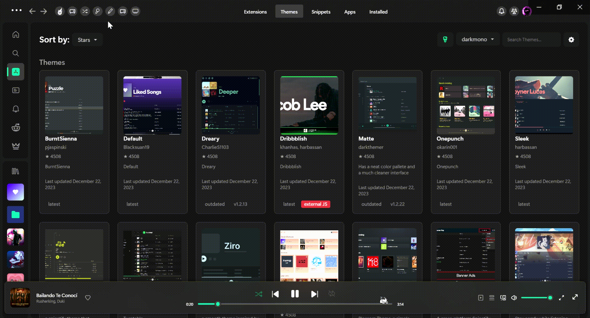

# Play a Random Song

[Spicetify](https://github.com/khanhas/spicetify-cli) extension to surprise yourself with a random track (plays a random song).

## Motivation

Hey there! Welcome to my second Spicetify gig – a seemingly pointless (again?) yet oddly fascinating extension. The idea struck me on New Year's Eve when I pondered what my first song of the next year would/should be. Not wanting to leave it to playlist shuffles or specific searches, I crafted this extension to play a completely random track. It turns out, exploring new, sometimes obscure, songs is way more fun than I thought. Join me in this musical adventure, and who knows, you might stumble upon some hidden gems too!

## Install

Copy `playRandom.mjs` into your [Spicetify](https://github.com/khanhas/spicetify-cli) extensions directory:
| **Platform** | **Path** |
|----------------|--------------------------------------------------------------------------------------|
| **Linux** | `~/.config/spicetify/Extensions` or `$XDG_CONFIG_HOME/.config/spicetify/Extensions/` |
| **MacOS** | `~/spicetify_data/Extensions` or `$SPICETIFY_CONFIG/Extensions` |
| **Windows** | `%appdata%\spicetify\Extensions\` |

After putting the extension file into the correct folder, run the following command to install the extension or install through marketplace:

```sh
spicetify config extensions playRandom.mjs
spicetify apply
```

Note: Using the `config` command to add the extension will always append the file name to the existing extensions list. It does not replace the whole key's value.

Or you can manually edit your `config-xpui.ini` file. Add your desired extension filenames in the extensions key, separated them by the | character.
Example:

```ini
[AdditionalOptions]
...
extensions = autoSkipVideo.js|bookmark.js|fullAppDisplay.js|playRandom.mjs
```

Then run:

```sh
spicetify apply
```

## Usage

- Simply install the extension and click the shuffle button/icon located on the top bar(mostly top-left).
- After a brief moment, the app will play a random track, adding an element of surprise to your music experience.
- Note: It will clear your current context queue, but any songs queued manually by you will remain. If all manually queued songs are played, similar songs to the randomly played track will line up and play if you have the "Autoplay" setting enabled.

[](https://raw.githubusercontent.com/TechShivvy/spicetify-extensions/main/play-random/preview.gif)

## Credits

- [Delusoire](https://github.com/Delusoire) for the optimization help!

## More

🌟 Like it? Gimme some love!

[](https://github.com/TechShivvy/spicetify-extensions/)
If you find any bugs, please [create a new issue](https://github.com/TechShivvy/spicetify-extensions/issues/new/choose) on the GitHub repo.

