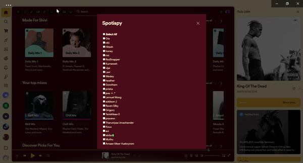

# Spotispy

[Spicetify](https://github.com/khanhas/spicetify-cli) extension to keep tabs on your pals. Whatever they listen to, anybody you decide to stalk, will be put to your queue.

## Install

Copy `spotispy.js` into your [Spicetify](https://github.com/khanhas/spicetify-cli) extensions directory:
| **Platform** | **Path** |
|----------------|--------------------------------------------------------------------------------------|
| **Linux** | `~/.config/spicetify/Extensions` or `$XDG_CONFIG_HOME/.config/spicetify/Extensions/` |
| **MacOS** | `~/spicetify_data/Extensions` or `$SPICETIFY_CONFIG/Extensions` |
| **Windows** | `%appdata%\spicetify\Extensions\` |

After putting the extension file into the correct folder, run the following command to install the extension or install through marketplace:

```sh
spicetify config extensions spotispy.js
spicetify apply
```

Note: Using the `config` command to add the extension will always append the file name to the existing extensions list. It does not replace the whole key's value.

Or you can manually edit your `config-xpui.ini` file. Add your desired extension filenames in the extensions key, separated them by the | character.
Example:

```ini
[AdditionalOptions]
...
extensions = autoSkipVideo.js|bookmark.js|fullAppDisplay.js|spotispy.js
```

Then run:

```sh
spicetify apply
```

## Usage

- Choose from the menu all of your friends who you wish to stalk. Your queue will now be updated anytime the chosen friends change songs.
- If you see that a song has been added to your queue but none of your friends are playing it, the visual updating in the friends activity window may have been delayed. You can update it instantly by simply toggling the friends menu.
- When you choose someone from the list, it won't add the music that they are now listening to right at that moment.

[](https://raw.githubusercontent.com/TechShivvy/spicetify-extensions/main/spotispy/preview.gif)

## Motivation

You might think this extension is a bit meh, and honestly, I'm on the same page! But here's the thing: I kinda enjoy checking out what tunes my friends are vibing to. I used to manually add their jam to my Queue, but I thought, "Why not automate it for a smoother experience?". So, I went ahead and did just that. Now, why do I get a kick out of peeping their music choices? It's not about being nosy, really. It's more like a rad way to discover tons of new music and genres. Plus, this project was my first-ever Spicetify gig, and I was super stoked to share it with everyone!

## Credits

- [Grigory](https://github.com/SunsetTechuila) for the coding assistance!

## More

🌟 Like it? Gimme some love!

[](https://github.com/TechShivvy/spicetify-extensions/)
If you find any bugs, please [create a new issue](https://github.com/TechShivvy/spicetify-extensions/issues/new/choose) on the GitHub repo.

